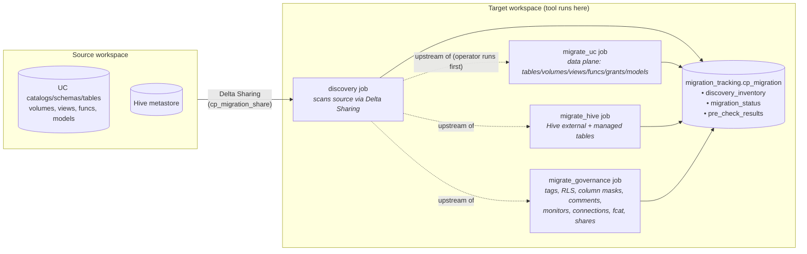
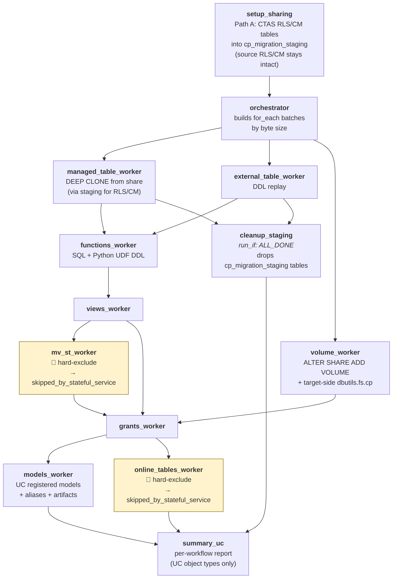
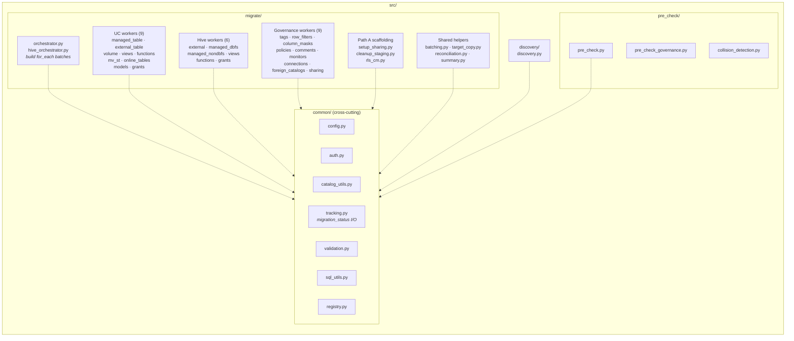

# Peer Review — Architecture & Workflow at a Glance

Two-minute orientation for a reviewer landing on this repo for the first time.

---

## 1. System view — four jobs + shared tracking

**Key contracts**

- `discovery` is the single source-of-truth scan — UC/Hive/Governance workflows all consume `discovery_inventory`.
- `migrate_uc`, `migrate_hive`, `migrate_governance` are **independent jobs**. Operator decides ordering. Governance trusts the operator: target tables must already exist.
- Every worker writes its own per-object row into `migration_status` (status + error_message + run_id). Re-runs filter by `get_pending_objects()`.
- All compute is serverless. Auth via migration SPN (OAuth).

---

## 2. Inside `migrate_uc` — Path A staging-copy + worker chain

**Reviewer focus areas**

| Area | File | Why it matters |
|---|---|---|
| Path A staging copy | `src/migrate/setup_sharing.py`, `src/migrate/cleanup_staging.py` | RLS/CM tables — source is never stripped. Replaced the old `drop_and_restore` risk class. |
| Worker idempotency | `src/migrate/*_worker.py` + `src/common/tracking.py:get_pending_objects` | Every worker re-runnable; status driven by `migration_status` LEFT JOIN on discovery. |
| Batching | `src/migrate/batching.py` | Byte-size for_each batches; oversize objects emit terminal-failed (post H6 fix). |
| Path A target copy | `src/migrate/target_copy.py` | Share-propagation retry for volumes (PR #51, 2026-05-20). |
| Hard-excluded types | `mv_st_worker.py`, `online_tables_worker.py` | Stateful services → out of scope, deliberate skip status. |

---

## 3. Code layout (where things live)

---

## Glossary

- **Path A** — staging-copy approach for RLS/CM tables: CTAS into `cp_migration_staging`, share the staging copy, never strip source.
- **UC** vs **Hive** vs **Governance** — three independent production jobs after the 2026-05-07 workflow split (PR #46). No global `migrate_all` umbrella.
- **for_each batches** — Databricks workflow `for_each` task with byte-sized inputs from orchestrator task values.
- **Stateful services** — DLT, Lakebase, Vector Search, Model Serving, Apps, ST, MV, Online Tables. Out of scope; deliberate `skipped_by_stateful_service_migration` status.
