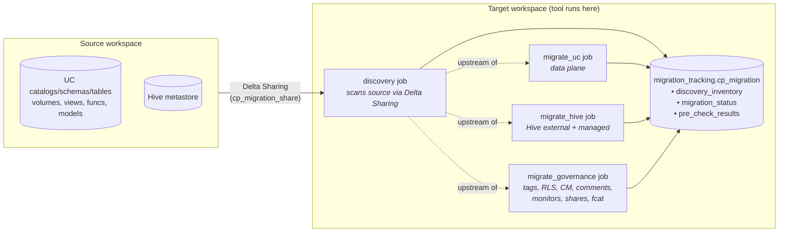

# Workspace Migration — User Guide

A Databricks Asset Bundle (DAB) that migrates Unity Catalog and legacy Hive
Metastore objects between Databricks workspaces.

---

## 1. Overview

### What it does

`workspace-migration` is a self-contained DAB that replays a source
workspace's Unity Catalog and Hive Metastore objects into a target
workspace. It moves data (managed-table bytes), structure (catalogs,
schemas, tables, views, functions, volumes), and governance (grants,
tags, row filters, column masks, customer shares) — without requiring
data egress through external storage.

### When to use it

- **Control-plane migrations** — moving a workspace between regions or
  cloud account boundaries (e.g. UK West → UK South).
- **Account consolidations** — merging multiple Databricks accounts into
  one.
- **Region moves** — relocating workloads closer to users or data
  sources.
- **Workspace re-platforming** — moving onto a fresh workspace with
  updated networking, identity, or compute defaults.

### How data moves

Managed-table bytes move via **Delta Sharing + `DEEP CLONE`** — the tool
creates an internal share on source, the target consumes it as a foreign
catalog, and each managed table is cloned into the target's UC. No
intermediate object storage is required. External tables, views,
functions, and governance objects are replayed via DDL.

### Design tenets

- **Idempotent** — every worker re-runnable; status is tracked
  per-object in a Delta table, so re-runs only act on pending objects.
- **No source mutation** — source workspace is never modified for
  managed-table migration. Row-filter / column-mask tables use a
  staging-copy pattern (Path A) that never strips source policies.
- **Standalone jobs** — UC, Hive, and Governance are independent
  workflows; operators decide ordering.
- **Serverless-only compute** — no cluster management, no init scripts.
- **Auditable** — every action lands a row in `migration_status` with a
  Lakeview dashboard summarising counts, failures, and durations.

---

## 2. High-level architecture



**Core components**

| Component | Role |
|---|---|
| `pre_check` job | Validates connectivity, grants, target collisions, RLS/CM admin-bypass invariants. Run before any side-effecting job. |
| `discovery` job | Inventories source via Delta Sharing + REST. Populates `discovery_inventory`. |
| `migrate_uc` job | UC data plane: managed tables, external tables, views, functions, volumes, models, grants. |
| `migrate_hive` job | Hive (legacy): databases, tables, views, functions, grants — migrated into a UC target catalog. |
| `migrate_governance` job | Fine-grained governance: tags, RLS, column masks, comments, monitors, customer shares, foreign catalogs, connections, policies. |
| `migrate_vector_search` job | Optional add-on: recreates Delta Sync Vector Search indexes on the target and triggers re-embedding from the already-migrated source Delta table. |
| `migrate_online_tables` job | Optional add-on: converts each discovered legacy online table into a **Lakebase synced table** on the target (legacy online tables are deprecated; creation is blocked platform-wide). Re-syncs from the already-migrated source Delta table into a Lakebase database instance the job creates. |
| `migration_tracking.cp_migration` | Three Delta tables holding discovery inventory, per-object status, pre-check results. |
| Lakeview dashboard | Visual progress + failure surface. Deployed by the bundle. |

A more detailed view (per-job task graph, code layout) lives in
[docs/peer-review-diagrams.md](peer-review-diagrams.md) and as an
openable HTML viewer at [docs/peer-review-diagrams.html](peer-review-diagrams.html).

---

## 3. Features

### Supported today

**Unity Catalog**

| Category | Coverage |
|---|---|
| Containers | Catalogs, schemas |
| Data | Managed tables (Delta), managed Iceberg (via DDL replay opt-in), external tables |
| Code | Views, SQL functions, Python UDFs |
| Files | Volumes (managed with file-level copy, external via metadata) |
| Access | Grants (catalog/schema/table/volume/function) |
| Governance | Tags, row filters, column masks, ABAC policies, comments |
| Sharing | Customer-defined shares, recipients, providers (tables, views, volumes, schemas, catalogs) |
| Other | Lakehouse monitors, registered models (metadata + aliases), connections, foreign catalogs |

**Legacy Hive Metastore**

- Databases, managed + external tables, views, functions, grants
- Migrated by the standalone `migrate_hive` job, written into a UC
  target catalog (`hive_target_catalog`, default `hive_upgraded`)

**Operational features**

- Dry-run mode (`dry_run: true`) — produces a full plan without DDL
- Catalog / schema filters — scope a run to specific namespaces
- Idempotent re-runs — `migration_status` filters out completed objects
- Collision handling (`on_target_collision: fail | skip`)
- RLS / column-mask migration via staging-copy (Path A)
- Iceberg DDL-replay strategy (opt-in via `iceberg_strategy: ddl_replay`)
- Byte-sized for-each batching to stay under the Databricks Jobs
  3000-byte payload limit
- Lakeview dashboard with per-object-type counts, failures, durations

### Deliberately out of scope today

Hard-skipped with a `skipped_by_stateful_service_migration` status — these
require dedicated cutover semantics and are planned for Phase 3 (see
next section):

- Streaming Tables (Kafka / Auto Loader checkpoints don't transfer)
- Materialized Views (rebuild semantics)

Online Tables were previously hard-skipped here; they are now migrated
by the standalone `migrate_online_tables` job (see Section 6, Step 8).

### Coming in Phase 3 — stateful services

| Service | Pattern | Notes |
|---|---|---|
| DLT pipelines | Spec + rebuild from UC (if UC-sourced) | Customer-owned definitions; checkpoints don't transfer |
| Streaming Tables | Source-cutover | Re-create + cutover watermark; previously hard-skipped |
| Materialized Views | Spec + rebuild | Re-create + REFRESH; previously hard-skipped |
| Online Tables | Convert to Lakebase synced table | Legacy online tables are deprecated (creation blocked platform-wide). **Available now** via `migrate_online_tables` job (see Section 6, Step 8): converts each online table to a Lakebase **synced table** re-syncing from the migrated source Delta table. Consumer repoint is operator-owned. |
| Vector Search indexes | Spec + rebuild | Delta Sync indexes: **available now** via `migrate_vector_search` job (see Section 6, Step 7). Direct Access indexes remain deferred. |
| Lakebase | Dump / restore | `pg_dump` / `pg_restore` out-of-band |
| Online Feature Store | Dump / restore | Out-of-band state move |
| Apps | Spec-only re-create | Read source app spec, POST to target |
| Model Serving endpoints | Spec-only re-create | Pure config replay |
| Genie spaces | Spec-only re-create | Configuration replay |
| Lakeflow Connect pipelines | Source-cutover | Cutover watermark via `START_DATE` or `row_filter` |
| Agent Bricks | AI compound | Wraps Model Serving + VS + KA + prompt config |

Current scope and cutover notes live in
[docs/stateful_services_phase.md](stateful_services_phase.md); a full
Phase 3 design spec is forthcoming.

---

## 4. Pre-requisites

### Tooling (on the operator's local machine)

- **Databricks CLI** ≥ 0.220 — install via `brew install databricks` or
  the official installer.
- **Terraform 1.5.7+** locally — the bundled Terraform in the
  Databricks CLI has an expired GPG signing key; you'll point the CLI
  at your local Terraform via env vars (see Step 5 below).
- **uv** (or `pip`) — only needed if you plan to run the unit tests.

### Access

- **Both workspaces** on the same cloud and (currently) the same
  metastore region for Delta Sharing performance. Cross-region works
  but volume propagation may lag.
- **Service Principal (SPN)** — OAuth M2M, will run all migration
  jobs. Must be a workspace admin on **both** source and target. See
  Set Up step 2.
- **Network connectivity** — serverless compute must be reachable from
  the target workspace. If source uses Private Link, the SPN's source-side
  REST calls also need to traverse the customer's network controls.

### Workspaces

- **Target workspace must be empty or non-overlapping** with the
  source. Discovery surfaces target collisions during `pre_check`;
  resolve them (rename / drop / set `on_target_collision: skip`) before
  running migrate jobs.
- **Delta Sharing must be enabled** on both metastores (account
  console → Settings).

### Recommended state on source

- For RLS / column-mask tables you want to migrate **with data**: every
  active filter / mask function body must contain an admin-bypass call
  (`is_account_group_member(`, `is_member(`, or `is_user_in_group(`).
  `pre_check` enforces this.
- For customer-defined shares to be migrated: the migration SPN must
  own them or hold `USE SHARE` / `USE RECIPIENT` — see the Delta
  Sharing prerequisites section in the README.

---

## 5. Set up

### Step 1 — Clone the repo

```bash
git clone git@github.com:databricks-solutions/workspace-migration.git
cd workspace-migration
```

### Step 2 — Create or identify the migration SPN

Create an OAuth service principal in the **account console** (Identity
and access → Service principals → Add service principal), then either
**generate an OAuth client secret** in the account console UI, or via
the CLI:

```bash
# Add SPN to source workspace as an admin
databricks account workspace-assignments update <source-workspace-id> \
  --principal-id <spn-id> --permissions ADMIN

# Add SPN to target workspace as an admin
databricks account workspace-assignments update <target-workspace-id> \
  --principal-id <spn-id> --permissions ADMIN

# Generate OAuth client secret (note: shown once)
databricks account service-principal-secrets create <spn-id>
```

### Step 3 — Store the SPN secret in a Databricks secret scope (target workspace)

```bash
# Create a secret scope on the target workspace
databricks secrets create-scope migration --profile target-workspace

# Add the SPN OAuth secret under a known key
databricks secrets put-secret migration spn-secret --profile target-workspace
# Paste the secret value when prompted (or pass --string-value)
```

You will reference `migration` (scope) and `spn-secret` (key) in
`config.yaml`.

### Step 4 — Grant SPN privileges

The SPN needs UC privileges to read source and write target. The
following grants cover the standard path; tighten as needed.

```sql
-- On the source workspace (run as a metastore admin)
GRANT USE CATALOG ON ALL CATALOGS TO `<spn-application-id>`;
GRANT USE SCHEMA  ON ALL SCHEMAS  TO `<spn-application-id>`;
GRANT SELECT      ON ALL TABLES   TO `<spn-application-id>`;
GRANT READ VOLUME ON ALL VOLUMES  TO `<spn-application-id>`;

-- For customer-defined shares the SPN should migrate:
ALTER SHARE     `<share_name>`     OWNER TO `<spn-application-id>`;
ALTER RECIPIENT `<recipient_name>` OWNER TO `<spn-application-id>`;

-- On the target workspace
GRANT CREATE CATALOG ON METASTORE TO `<spn-application-id>`;
GRANT USE PROVIDER   ON METASTORE TO `<spn-application-id>`;
```

For the **`staging_copy` RLS/CM strategy**, also ensure every active
row-filter / column-mask function body contains an admin-bypass call
(see Pre-requisites). `pre_check` will fail loudly if not.

### Step 5 — Configure `config.yaml`

Open `config.yaml` (committed with **placeholder values only**) and
fill in real values locally:

```yaml
source_workspace_url: "https://adb-<source-id>.<n>.azuredatabricks.net"
target_workspace_url: "https://adb-<target-id>.<n>.azuredatabricks.net"
spn_client_id:        "<spn-application-id>"
spn_secret_scope:     "migration"
spn_secret_key:       "spn-secret"

# Optional — scope the run
catalog_filter: ["sales", "marketing"]
schema_filter:  []

# Recommended for RLS/CM
rls_cm_strategy: "staging_copy"

# Recommended for Iceberg if present in source
iceberg_strategy: "ddl_replay"

# Hive (only if migrating from Hive Metastore)
migrate_hive_dbfs_root: false
# hive_dbfs_target_path: "abfss://<container>@<account>.dfs.core.windows.net/hive-data/"
```

> **Don't edit the workspace-side copy of `config.yaml`.** The
> bundle treats your local copy as source of truth and overwrites
> the workspace copy on every deploy.

Full field reference: see the README's [Config reference table](../README.md#config-reference-configyaml).

### Step 6 — Deploy the bundle to the target workspace

The Databricks CLI's bundled Terraform has an expired signing key —
point at your locally-installed Terraform:

```bash
export DATABRICKS_TF_VERSION=1.5.7
export DATABRICKS_TF_EXEC_PATH=$(which terraform)

databricks bundle deploy -t dev \
  --var migration_spn_id=<spn-application-id> \
  --profile target-workspace
```

This creates:

- The seven workflows: `pre_check`, `discovery`, `migrate_uc`,
  `migrate_hive`, `migrate_governance`, `migrate_vector_search`,
  `migrate_online_tables` (plus integration-test workflows).
- The Lakeview dashboard at `/Shared/cp_migration/dev`.
- The `config.yaml` file at `/Workspace/Shared/cp_migration/config.yaml`.

---

## 6. Execution

The recommended order: `pre_check` → `discovery` → `pre_check` (again,
for collisions) → `migrate_uc` → `migrate_hive` (if applicable) →
`migrate_governance` → `migrate_vector_search` (optional) →
`migrate_online_tables` (optional).

### Step 1 — `pre_check`

Validates connectivity, SPN grants, and (after discovery has run)
target collisions and RLS/CM admin-bypass.

```bash
databricks jobs run-now --job-id <pre_check_job_id> --profile target-workspace
```

Read results:

```sql
SELECT check_name, status, severity, error_message
FROM migration_tracking.cp_migration.pre_check_results
WHERE run_id = <latest_run_id>
ORDER BY severity DESC, check_name;
```

Resolve any FAILs before continuing.

### Step 2 — `discovery`

Scans source via Delta Sharing + REST and populates
`discovery_inventory` with one row per source object.

```bash
databricks jobs run-now --job-id <discovery_job_id> --profile target-workspace
```

Read results:

```sql
SELECT source_type, object_type, COUNT(*) AS n
FROM migration_tracking.cp_migration.discovery_inventory
GROUP BY source_type, object_type
ORDER BY source_type, object_type;
```

### Step 3 — `pre_check` again (target-collision pass)

Now that `discovery_inventory` is populated, `pre_check` checks for
target objects with the same FQN that the tool didn't create.

With `on_target_collision: fail` (default) any unexpected target object
will block `migrate_uc`. Either rename / drop the colliding target
object, or switch to `on_target_collision: skip` and redeploy.

### Step 4 — `migrate_uc`

UC data plane: managed/external tables, views, functions, volumes,
models, plus UC grants. Workers run in parallel where dependencies
allow.

```bash
databricks jobs run-now --job-id <migrate_uc_job_id> --profile target-workspace
```

Monitor progress:

- **Lakeview dashboard** at `/Shared/cp_migration/<target>` — counts,
  failures, durations per object type.
- **`migration_status`** for per-object detail:

```sql
SELECT object_type, status, COUNT(*) AS n
FROM migration_tracking.cp_migration.migration_status
WHERE source_type = 'uc'
GROUP BY object_type, status
ORDER BY object_type, status;
```

Re-runs are safe — `migration_status` filters out completed objects.

### Step 5 — `migrate_hive` (only if migrating from Hive Metastore)

Same shape as `migrate_uc`, scoped to Hive sources. Writes into the
target UC catalog set by `hive_target_catalog` (default
`hive_upgraded`).

```bash
databricks jobs run-now --job-id <migrate_hive_job_id> --profile target-workspace
```

### Step 6 — `migrate_governance`

**Run last.** This job assumes target tables / views / volumes already
exist (from `migrate_uc` and / or `migrate_hive`). It replays the
governance layer: tags, RLS, column masks, comments, monitors, customer
shares, foreign catalogs, connections, policies.

```bash
databricks jobs run-now --job-id <migrate_governance_job_id> --profile target-workspace
```

### Step 7 — `migrate_vector_search` (optional)

Recreates **Delta Sync** Vector Search indexes on the target workspace.
Running this job is itself the opt-in — there is no configuration flag
to enable or disable it. Bear in mind that re-embedding every index
against the target source tables incurs compute cost proportional to
the size of those tables.

**Precondition:** run `migrate_uc` first (Step 4). The job performs an
up-front pre-check that verifies every index's source Delta table
exists on the target — if any are missing, the pre-check fails loudly
before creating anything.

```bash
databricks jobs run-now --job-id <migrate_vector_search_job_id> --profile target-workspace
```

The job also ensures the target Vector Search endpoint exists before
attempting to create indexes. If the named endpoint does not exist it
is created automatically; if it exists but is still provisioning the
affected indexes are skipped and retried on the next run.

Monitor progress in `migration_status`:

```sql
SELECT object_name, status, error_message
FROM migration_tracking.cp_migration.migration_status
WHERE object_type = 'vector_search_index'
ORDER BY status, object_name;
```

**Status values**

| Status | Meaning |
|---|---|
| `created_resync_pending` | Index created on target; re-embedding is in progress. The index is not queryable until the re-sync completes. |
| `skipped_endpoint_not_ready` | The target endpoint was still provisioning when this index was processed. Re-run the job — idempotency will retry the index. |
| `skipped_target_exists` | The index already exists on the target (set by a previous run or pre-existing). No action taken. |
| `failed` | Index creation failed. Inspect `error_message` and the workflow run logs, then re-run. |

**Known limitations**

- **Direct Vector Access indexes are not migrated** — they are recorded
  `skipped_direct_access_unsupported`. Their vectors are written
  directly by your application (external state) and cannot be recreated
  by this tool.
- **Custom embedding-model serving endpoints are not checked or
  migrated.** If a Delta Sync index uses a custom model serving endpoint
  for embeddings, ensure that endpoint exists on the target before
  running. Databricks-hosted embedding models (e.g.
  `databricks-gte-large-en`) are available by default and are
  unaffected.

### Step 8 — `migrate_online_tables` (optional)

Converts each discovered legacy online table into a **Lakebase synced
table** on the target workspace. Legacy UC online tables are deprecated
and can no longer be created platform-wide; this job re-syncs the same
data from the already-migrated source Delta table into a Lakebase
database instance. Running this job is itself the opt-in — there is no
configuration flag to enable or disable it.

**Paid resource — Lakebase database instance.** The job provisions a
Lakebase database instance (configured via `lakebase_instance_name`,
`lakebase_logical_database`, and `lakebase_capacity` in `config.yaml`),
creating it if it does not exist. This is a **paid resource** that
persists after the migration completes. Factor this into your cost
planning; decommission the instance manually if it is no longer needed.

**Precondition:** run `migrate_uc` first (Step 4). The job performs an
up-front pre-check that verifies every online table's source Delta
table exists on the target **with a primary key** — synced-table
creation fails without a primary key and the object is recorded
`failed`. Ensure the source Delta table was migrated with its primary
key intact.

**Consumer repoint is operator-owned.** Once a synced table is
created, consumer applications must be updated to connect to the new
Lakebase Postgres endpoint. This cut-over is outside the scope of the
tool.

```bash
databricks jobs run-now --job-id <migrate_online_tables_job_id> --profile target-workspace
```

Monitor progress in `migration_status`:

```sql
SELECT object_name, status, error_message
FROM migration_tracking.cp_migration.migration_status
WHERE object_type = 'online_table'
ORDER BY status, object_name;
```

**Status values**

| Status | Meaning |
|---|---|
| `created_resync_pending` | Synced table created on target; re-sync from the source Delta table is in progress. The table is not queryable until the sync completes. |
| `skipped_target_exists` | A synced table with this name already exists on the target (set by a previous run or pre-existing). No action taken. |
| `skipped_instance_not_ready` | The Lakebase database instance was still provisioning when this table was processed. Re-run the job — idempotency will retry the table once the instance is ready. |
| `failed` | Synced table creation failed (e.g. missing primary key on the source Delta table). Inspect `error_message` and the workflow run logs, then re-run. |

**Known limitations**

- **Consumer repoint required.** Downstream applications that read
  from the old online table endpoint must be reconfigured to use the
  new Lakebase Postgres endpoint — this is an operator action outside
  the tool's scope.
- **Primary key mandatory.** If the source Delta table was migrated
  without a primary key, synced-table creation will fail. Verify the
  target table schema before running.

### Step 9 — Verify

Confirm via the dashboard and these checks:

```sql
-- Anything that failed?
SELECT object_type, status, error_message, COUNT(*) AS n
FROM migration_tracking.cp_migration.migration_status
WHERE status NOT IN ('validated', 'skipped_by_config',
                     'skipped_by_rls_cm_policy',
                     'skipped_by_pipeline_migration',
                     'skipped_by_stateful_service_migration',
                     'skipped_target_exists',
                     'skipped_direct_access_unsupported',
                     'skipped_endpoint_not_ready',
                     'skipped_instance_not_ready',
                     'created_resync_pending',
                     'dry_run')
GROUP BY object_type, status, error_message
ORDER BY n DESC;

-- Anything pending (worker never picked it up)?
SELECT object_type, COUNT(*) AS pending
FROM migration_tracking.cp_migration.discovery_inventory d
LEFT JOIN migration_tracking.cp_migration.migration_status m
  ON m.object_name = d.object_name AND m.object_type = d.object_type
WHERE m.object_name IS NULL
GROUP BY object_type;
```

---

## 7. Troubleshooting & FAQ

**`bundle deploy` fails with "key expired"** — Use a local Terraform
(Step 6 setup).

**`pre_check` reports target collisions you didn't create** — Either
rename / drop them, or set `on_target_collision: skip` and redeploy.
The tool will leave those target objects untouched and mark the
corresponding source rows `skipped_target_exists`.

**Customer-defined share not appearing in discovery** — The migration
SPN must own the share or hold `USE SHARE`. See the
[Delta Sharing prerequisites](../README.md#delta-sharing-prerequisites)
section.

**RLS / column-mask table arrives empty on target** — Default
`rls_cm_strategy` is `""` (skip). Set `rls_cm_strategy: staging_copy`
and ensure every filter / mask function has an admin-bypass call.

**Volume contents missing on target** — Cross-region Delta Sharing
volume propagation can lag. The tool now retries volume `ls` calls; if
issues persist, re-run `migrate_uc` — idempotency handles it.

**A worker keeps failing** — Check `migration_status.error_message`
and the workflow run logs. Re-run the job; only failed objects are
retried.

---

## 8. Going deeper

- Detailed architecture + per-job task graph:
  [docs/peer-review-diagrams.md](peer-review-diagrams.md)
- Workflow split rationale: [docs/workflow_split_design.md](workflow_split_design.md)
- Idempotency model: [docs/idempotency_audit.md](idempotency_audit.md)
- Retry / resumability: [docs/retry_resumability.md](retry_resumability.md)
- Stateful services (Phase 3) scope: [docs/stateful_services_phase.md](stateful_services_phase.md)
- External Hive Metastore notes: [docs/external_hive_metastore.md](external_hive_metastore.md)
